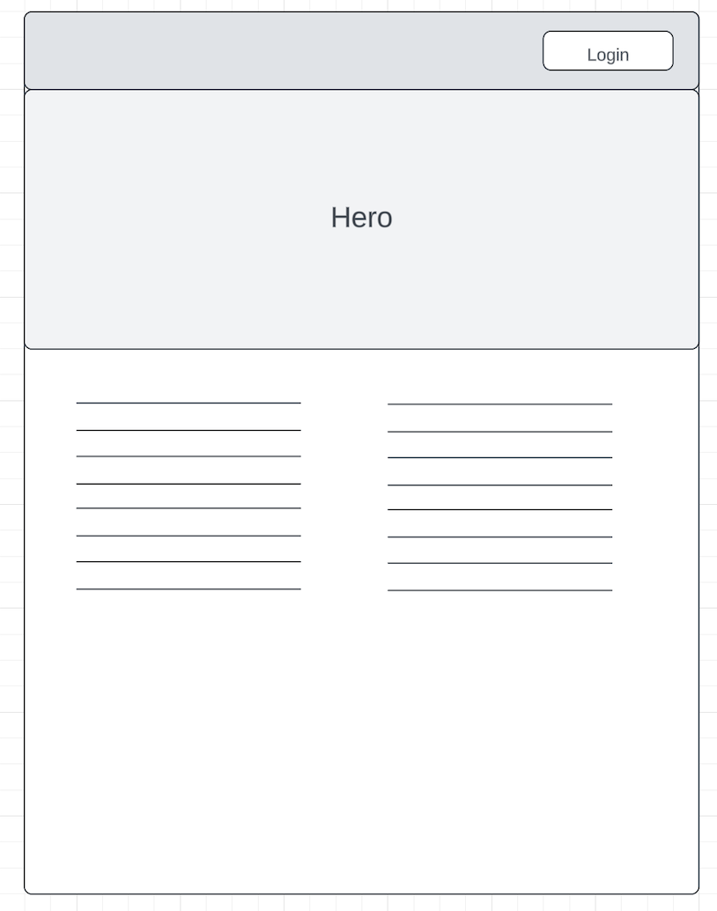
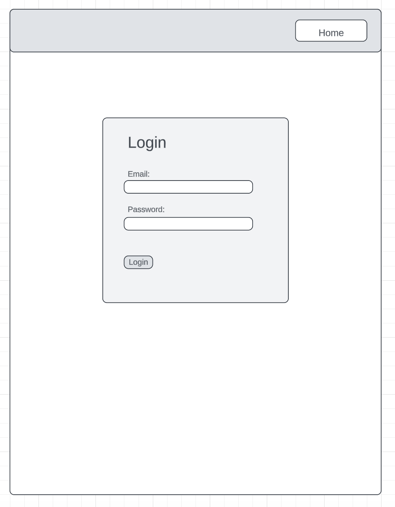
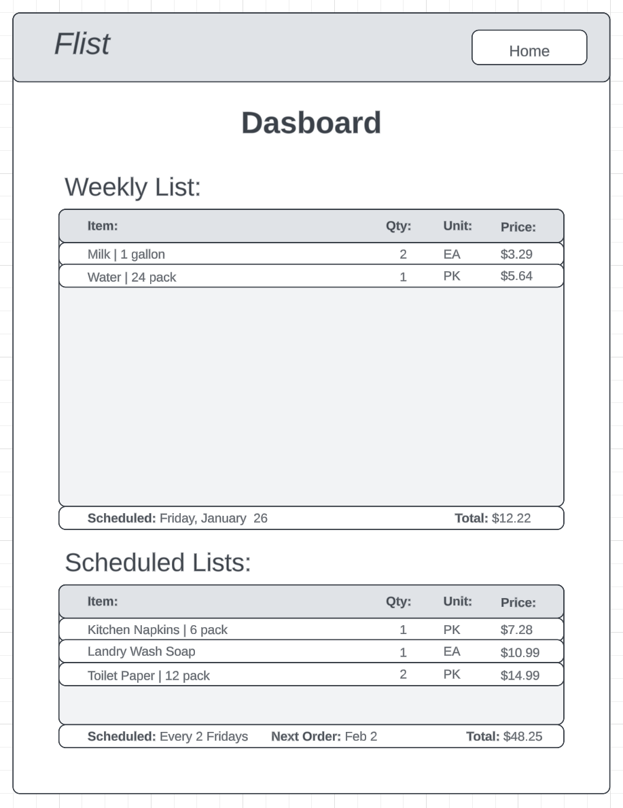

# Flist

## Overview

Flist is a web app that will be able to schedule your groceries to be order on specific dates that you select. There'll be an empty Weekly List that you set it to order your gorceries, and add items as the week goes by before the scheduled date. And there will also be a section where you can add multiple Scheduled Lists that allow you to automatically order items (eg. 3 packs of water every 2 weeks, 1 dozen of eggs every week).

### Problem

I believe that grocery shopping can mostly be repeteive and, in my opinion it can be tedious and time consuming. Due to it being mostly repetetive, I brainstormed solutions to develop a solution that could dynamically automate grocery shopping. And also could solve the problem with the chances of forgetting to buy something while shopping.

### User Profile

- Anyone:
    -looking to reduce time spent in grocery shopping.
    -looking to be more efficient with shopping for groceries. 

### Features

-As a user, I want to be able to set my groceries to be ordered every week on Fridays.
-As a user, I want to be able to add items through the week days before order is submitted on Friday.
-As a user, I want to be able to recieve text/email notifications of my weekly list before it's submitted.
-As a user, I want to be able to view the current items in the list and see the Weekly List grow as I add items throughout the week.


## Implementation

### Tech Stack

List technologies that will be used in your app, including any libraries to save time or provide more functionality. Be sure to research any potential limitations.

- MongoDB
- Express
- React
- Node
- Client libraries: 
    - react
    - react-router
    - axios
- Server libraries:
    - express
    - bcrypt for password hashing

### APIs

I will be using my own RESTful API, no external APIs be used.

### Sitemap

-Landing Page
-Login/Sign Up Page
-Dashboard

### Mockups

#### Landing Page


#### Login/Sign Up Page


#### Dashboard


### Data

MongoDB will be used for this app, and it's a non-relational database.

### Endpoints

**GET /items**

Response:
```
[
    {
        "id": 1,
        "item_name": "Milk",
        "item_description": "1 gallon",
        "item_price": 3.29,
        "item_unit": "ea",
    },    
    {
        "id": 2,
        "item_name": "Eggs",
        "item_description": "1 Dozen",
        "item_price": 5.74,
        "item_unit": "pk",
    },
    ...
]
```

**GET /items/:itemId**

```
[
    {
        "id": 2,
        "item_name": "Eggs",
        "item_description": "1 Dozen",
        "item_price": 5.74,
        "item_unit": "pk",
    }
]
```

**POST /items**


Parameters:
- name: Name of item
- description: Item description
- unit: Unit of item
- price: Item price

Response:
```
[
    {
        "id": 4,
        "item_name": "Toilet Paper",
        "item_description": "12 pack",
        "item_price": 10.99,
        "item_unit": "pk",
    }
]
```

**GET /weekly-list**

- There will only be one weekly list allowed
- sheduled_date: Timestamp will vary depending on selected schedule date.

```
[
    {
        "id": 1
        "scheduled_date": 1706057788195,
    }
]
```

**POST /weekly-list**

- There will only be one weekly list allowed
- sheduled_date: Timestamp will be placed with the scheduled date that the user has selected.


```
[
    {
        "id": 1
        "scheduled_date": 1706057788195,
    }
]
```

**POST /weekly-list/:itemId**

- When the user selects an item, it'll get the id of the item and will pass it into the POST request function, so it can be recieved in the API and find the item based on the item id. Then added to the weekly list.


```
[
    {
        "id": 1
        "scheduled_date": 1706057788195,
        "items": {
            "id": 1,
            "item_name": "Milk",
            "item_description": "1 gallon",
            "item_price": 3.29,
            "item_unit": "ea",
            "quanity": 2,
            "weekly_list": true,
            "scheduled_date": 17060577886741,
        },
    }
]
```

**GET /scheduled-lists**

- sheduled_date: Timestamp will vary depending on selected schedule date.

```
[
    {
        "id": 1
        "scheduled_date": 1706057788195,
        "items": {
            "id": 1,
            "item_name": "Milk",
            "item_description": "1 gallon",
            "item_price": 3.29,
            "item_unit": "ea",
            "quanity": 2,
        },
        {
            "id": 2,
            "item_name": "Eggs",
            "item_description": "1 Dozen",
            "item_price": 5.74,
            "item_unit": "pk",
            "quanity": 1,
        }
        ...
    },
    {
        "id": 2
        "scheduled_date": 1706057786935,
        "items": {
            "id": 4,
            "item_name": "Toilet Paper",
            "item_description": "12 pack",
            "item_price": 10.99,
            "item_unit": "pk",
            "quanity": 2,
        },
        ...
    },   
    ...
]
```

**POST /scheduled-lists/:listId**

- sheduled_date: Timestamp will vary depending on selected schedule date.

```
[
    {
        "id": 1
        "scheduled_date": 1706057788195,
        "items": {
            "id": 1,
            "item_name": "Milk",
            "item_description": "1 gallon",
            "item_price": 3.29,
            "item_unit": "ea",
            "quanity": 2,
        },
        {
            "id": 2,
            "item_name": "Eggs",
            "item_description": "1 Dozen",
            "item_price": 5.74,
            "item_unit": "pk",
            "quanity": 1,
        }
        ...
    },
    {
        "id": 2
        "scheduled_date": 1706057786935,
        "items": {
            "id": 4,
            "item_name": "Toilet Paper",
            "item_description": "12 pack",
            "item_price": 10.99,
            "item_unit": "pk",
            "quanity": 2,
        },
        ...
    },   
    ...
]
```

**POST /users/register**

- Add a user account

Parameters:

- email: User's email
- password: User's provided password

Response:
```
{
    "token": "seyJhbGciOiJIUzI1NiIsInR5cCI6IkpXVCJ9.eyJzdWIiOiIxMjM0NTY3ODkwIiwibmFtZSI6I..."
}
```

**POST /users/login**

- Login a user

Parameters:
- email: User's email
- password: User's provided password

Response:
```
{
    "token": "seyJhbGciOiJIUzI1NiIsInR5cCI6IkpXVCJ9.eyJzdWIiOiIxMjM0NTY3ODkwIiwibmFtZSI6I..."
}
```

### Auth

- JWT will be use for authentication/authorization
    - Store JWT in localStorage, remove when a user logs out
    - Added after core features have first been implemented

## Roadmap

Scope your project as a sprint. Break down the tasks that will need to be completed and map out timeframes for implementation. Think about what you can reasonably complete before the due date. The more detail you provide, the easier it will be to build.

- Create client
    - Components
    - Pages
    - Routing

- Create server
    - Create controllers
    - Create API end points 

- Feature: View items
    - Create a GET /items

- Feature: View an specific item
    - Create a GET /items/:itemId

- Feautre: Create an item
    - Create a POST /items

- Feature: View weekly list
    -Creat a GET /weekly-list request

- Feature: Add to weekly list
    - Add form component that the user fills in.
    - User selects item
    - Create a POST /weekly-list/:itemId
    - Create a GET /weekly-list after posting to update state of the weekly list

- Feaure: View scheduled lists
    - Create a GET /scheduled-lists
    - Renders List components depending on array length

- Feature: Create a schedule list.
    - Create a POST /scheduled-list

- Feature: Add item to scheduled list
    - Create POST /scheduled-list/:listId

- Feature: Create account
    - Implement register page + form
    - Create POST /users/register endpoint

- Feature: Login
    - Implement login page + form
    - Create POST /users/login endpoint

- Feature: Implement JWT tokens
    - Server: Update expected requests / responses on protected endpoints
    - Client: Store JWT in local storage, include JWT on axios calls

- Bug fixes

- DEMO DAY

## Nice-to-haves

- Intergrate Amazon API to be able to link accounts, to when the list scheduled date is met, it'll place all those items in your Amazon cart ready to be ordered.